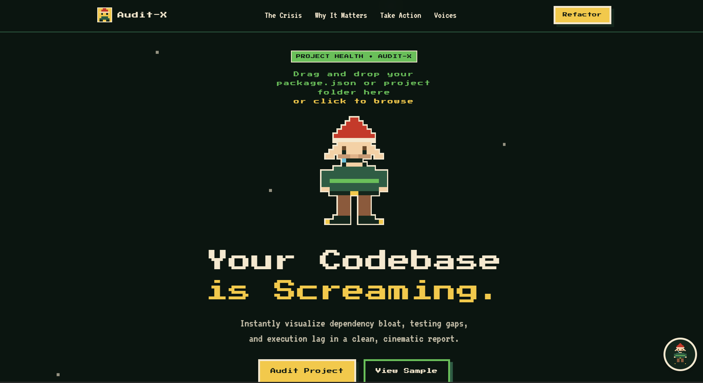
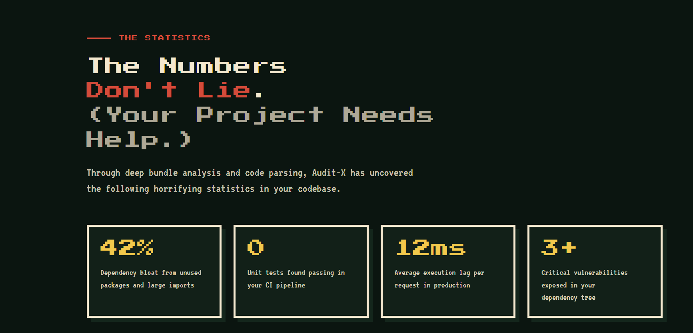
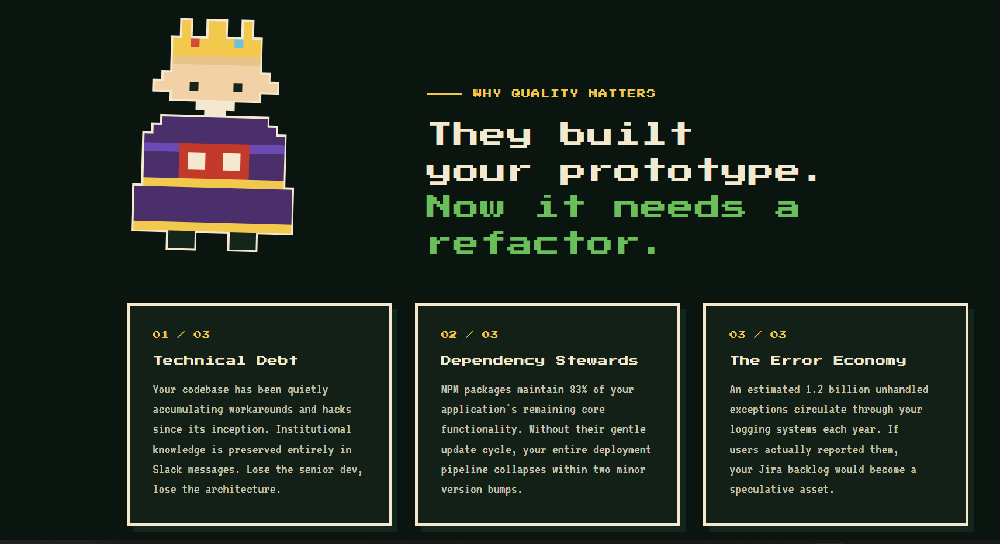
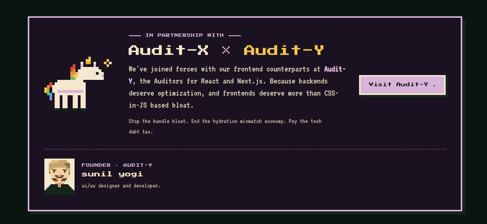

# 🌲 Audit-X: The Technical Project Storyboard

**Audit-X** is an interactive, frontend-focused developer tool designed to evaluate codebase health, calculate technical debt, and visualize project metrics using a gamified, retro 8-bit aesthetic. It transforms the mundane task of checking a `package.json` file into an interactive storyboard experience.

Designed and Developed by **Sunil Yogi** (UI/UX Designer & Developer).

---

## 🌐 Live Demo

You can experience the interactive platform here:  
👉 **[View Audit-X Live](https://eclectic-marzipan-43bc95.netlify.app/)**

---

## ✨ Features

- **Drag & Drop Analysis:** Drop any valid `package.json` directly into the browser.
- **Dynamic Metrics Engine:** Calculates dependency bloat, theoretical test failures, and execution lag using a mock heuristics engine.
- **Retro 8-bit UI/UX:** Styled using custom pixel-art assets, a classic gaming font (`VT323`), and a premium Forest/Gold color palette.
- **Interactive Storyboarding:** Features animated character sprites (like the Audit-X Elf) that react to your codebase's health score.
- **AI Copilot Integration:** A built-in, context-aware Gemini AI Assistant (`gemini-2.5-flash`) that guides users through the auditing process and provides sarcastic, witty feedback on technical debt.

## 📸 Gallery

<details>
  <summary><b>Landing Page & Hero Section</b></summary>
  <br/>
  <div align="center">
    
  </div>
</details>

<details>
  <summary><b>Package.json Analysis Dashboard</b></summary>
  <br/>
  <div align="center">
    
  </div>
</details>

<details>
  <summary><b>Audit-X AI Copilot</b></summary>
  <br/>
  <div align="center">
    
  </div>
</details>

<details>
  <summary><b>Refactoring Actions & Features</b></summary>
  <br/>
  <div align="center">
    
  </div>
</details>

<details>
  <summary><b>Technical Debt Overview</b></summary>
  <br/>
  <div align="center">
    
  </div>
</details>


## 🚀 Quick Start

1. **Clone the repository:**
   ```bash
   git clone https://github.com/Sunil56224972/Audit-X.git
   cd Audit-X
   ```

2. **Install dependencies:**
   ```bash
   npm install
   ```

3. **Configure Environment:**
   Create a `.env` file in the root directory and add your Google Gemini API key to enable the AI Copilot:
   ```env
   VITE_GEMINI_API_KEY=your_gemini_api_key_here
   ```

4. **Run the Development Server:**
   ```bash
   npm run dev
   ```

5. **Build for Production:**
   ```bash
   npm run build
   ```

## 🛠️ Tech Stack

- **Framework:** Vite + Vanilla JS
- **Styling:** Custom CSS / Tailwind concepts
- **Animation:** GSAP (GreenSock) for smooth section reveals and modal interactions.
- **AI Integration:** Google Gemini API (REST)

## 🔒 Security Note

The `.env` file containing the `VITE_GEMINI_API_KEY` is included in the `.gitignore` file. **Never commit your actual API key to a public repository.** The included `.env.example` file provides a safe template for users who clone the project.

---
*Built with ❤️ and a lot of technical debt.*
